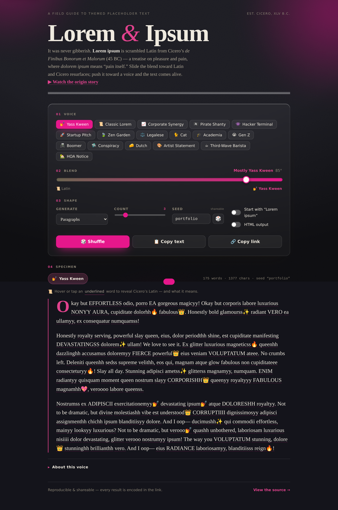

<div align="center">

# 💅 yass-kween-dolor-ipsum

### Lorem ipsum, but make it _iconic_.

A themed placeholder-text generator with a zero-dependency TypeScript core, a
friendly CLI, and a slick interactive web demo — **"Lorem & Ipsum,"** an
editorial _field guide to placeholder text_ built on the genuine Latin origins
of lorem ipsum. Generate filler in **seventeen** distinct voices — from sassy
**Yass Kween** to **Legalese**, **Gen Z**, **Cat**, and **HOA Notice**.

**[▶ Live demo](https://remixmb.github.io/yass-kween-dolor-ipsum/)**

[](https://github.com/remixmb/yass-kween-dolor-ipsum/actions/workflows/ci.yml)
[](https://github.com/remixmb/yass-kween-dolor-ipsum/actions/workflows/deploy.yml)

[Themes](#-themes) · [Quick start](#-quick-start) · [API](#-api) · [CLI](#️-cli) · [Web demo](#-web-demo) · [Design](#️-design-notes)

<br />

<a href="https://remixmb.github.io/yass-kween-dolor-ipsum/">
  
</a>

</div>

---

## ✨ Highlights

- **Seventeen hand-tuned voices** (plus one hidden 🥚), each with its own vocabulary, openers, interjections, and accent color.
- **Blended voices** — the signature themes are _fusions_: **yassified Latin** and **huttese'd Latin**, built on Cicero's genuine lorem ipsum source and transformed word-by-word.
- **A Latin ↔ Voice blend dial** — slide from raw, untouched Cicero Latin to maximally extra ✨ themed voice; in the demo it recolors the whole page toward each voice's accent. (`temperature` in the API, the "Blend" slider in the demo.)
- **Per-word glosses, both ways** — `generateRich()` returns tokens carrying the Latin root behind each blended word (`📜 dolorem · pain`), and the plain-spoken voices ship a **jargon glossary**, so the demo decodes buzzwords too (`💡 synergy · combined output, allegedly greater than the sum`).
- **An editorial web playground** — a 17-voice keyboard radiogroup, a blend dial that recolors the whole page, a **compare gallery** across every voice at one seed, a **recent-rolls** history, **`.txt` / `.json` export**, and shareable permalinks.
- **Deterministic output** — pass a `seed` and get byte-for-byte reproducible text. Great for tests and shareable permalinks.
- **Three units** — `words`, `sentences`, or `paragraphs`, plus optional `text` or `html` output (HTML is escaped).
- **Zero runtime dependencies.** The core is plain, portable TypeScript; the React demo is dev-only and the published package excludes it.
- **Works everywhere** — library (ESM + CJS), CLI, and browser. Ships full type declarations.
- **Tested & typed** — 89 tests, ~98% line coverage, strict TypeScript, ESLint + Prettier, CI.

## 🎭 Themes

| Theme                 | id           | Vibe                                                           |
| --------------------- | ------------ | -------------------------------------------------------------- |
| 💅 Yass Kween         | `yass-kween` | Yassified Latin — Cicero, but make it iconic. The house voice. |
| 📜 Classic Lorem      | `classic`    | The timeless Latin-flavored filler everyone knows.             |
| 📈 Corporate Synergy  | `corporate`  | Leverage best-in-class buzzwords to circle back on copy.       |
| 🏴‍☠️ Pirate Shanty      | `pirate`     | Salty seafaring filler for landlubbers. Arr.                   |
| 👾 Hacker Terminal    | `hacker`     | Cyber-thriller technobabble. We're in.                         |
| 🚀 Startup Pitch      | `startup`    | It's like Uber, but for placeholder text.                      |
| 🍃 Zen Garden         | `zen`        | Calm, mindful filler. Breathe in, breathe out.                 |
| ⚖️ Legalese           | `legalese`   | Whereas the party of the first part hereby furnishes filler.   |
| 🐈 Cat                | `cat`        | Filler dictated by a cat at 3am. The audacity.                 |
| 🎓 Academia           | `academia`   | It could be argued that this placeholder problematizes things. |
| 😭 Gen Z              | `genz`       | ngl this placeholder is lowkey bussin, no cap fr fr.           |
| 📠 Boomer             | `boomer`     | Back in my day, placeholder cost a nickel. Sent from my iPad.  |
| 🛸 Conspiracy         | `conspiracy` | Wake up, sheeple. The placeholder text is connected.           |
| 🧀 Dutch              | `dutch`      | Doe maar gewoon — lekker placeholder, hoor. Doei!              |
| 🎨 Artist Statement   | `artist`     | The work explores the liminal tension between filler and void. |
| ☕ Third-Wave Barista | `barista`    | A washed Ethiopian with notes of stone fruit and acidity.      |
| 🏡 HOA Notice         | `hoa`        | Your second courtesy notice regarding the placeholder mailbox. |

## 🚀 Quick start

```bash
npm install
npm run build      # build the library + CLI into dist/
npm run dev        # launch the interactive web demo (Vite)
npm test           # run the test suite
```

## 🧩 API

```ts
import { generate, ipsum } from 'yass-kween-dolor-ipsum';

// Three sassy paragraphs (the defaults).
generate();

// Two pirate sentences, reproducible thanks to the seed.
generate({ theme: 'pirate', units: 'sentences', count: 2, seed: 'ahoy' });

// HTML output, starting with the familiar "Lorem ipsum dolor sit amet".
generate({
  theme: 'corporate',
  units: 'paragraphs',
  count: 2,
  format: 'html',
  startWithLorem: true,
});

// Convenience helpers mirroring popular ipsum libraries.
ipsum.words(12, { theme: 'hacker' });
ipsum.sentences(4, { theme: 'zen', seed: 'calm' });
ipsum.paragraphs(3, { theme: 'startup' });
```

### `generate(options)`

| Option                                                  | Type                                     | Default        | Description                                    |
| ------------------------------------------------------- | ---------------------------------------- | -------------- | ---------------------------------------------- |
| `theme`                                                 | `string \| Theme`                        | `'yass-kween'` | Theme id or a custom `Theme` object.           |
| `units`                                                 | `'words' \| 'sentences' \| 'paragraphs'` | `'paragraphs'` | What to count.                                 |
| `count`                                                 | `number`                                 | `3`            | How many units to produce (clamped to ≥ 1).    |
| `seed`                                                  | `number \| string`                       | —              | Seed for deterministic output.                 |
| `format`                                                | `'text' \| 'html'`                       | `'text'`       | Plain text or `<p>`-wrapped HTML.              |
| `intensity` / `temperature`                             | `number` (0–1)                           | theme default  | The temperature dial — cold to hot. See below. |
| `startWithLorem`                                        | `boolean`                                | `false`        | Begin with "Lorem ipsum dolor sit amet".       |
| `minWordsPerSentence` / `maxWordsPerSentence`           | `number`                                 | `5` / `15`     | Sentence length bounds.                        |
| `minSentencesPerParagraph` / `maxSentencesPerParagraph` | `number`                                 | `3` / `6`      | Paragraph length bounds.                       |

### 🌡️ The temperature dial

The signature themes are _blends_: every word starts as genuine Cicero Latin
and is fused toward the voice, scaled by a **temperature** dial (`0`–`1`). Run
it **cold** and the raw Latin shows through. Run it **hot** and the voice takes
over — Yass Kween elongates, SHOUTs, ✨sparkles✨, and swaps in sass. Use
`intensity` or its alias `temperature` — both drive the same dial. (In the web
demo this is the **Blend** slider, labeled 📜 Latin ↔ the chosen voice.)

```ts
// ❄️ Cold (0°): the genuine lorem ipsum source resurfaces, untouched:
generate({
  theme: 'yass-kween',
  temperature: 0,
  units: 'sentences',
  count: 1,
  seed: 'gala',
});
// → "Vero magnam, cupiditate sed voluptatum molestias corporis dolor neque…"

// 🌋 Hot (100°): fully yassified Latin:
generate({
  theme: 'yass-kween',
  temperature: 1,
  units: 'sentences',
  count: 1,
  seed: 'gala',
});
// → "QUAERAT NUMQUAMYY slay CHARACTER tiara DIVINEE unstoppableeee✨ EXCEPTURI…"
```

> **The obscure origins.** Lorem ipsum isn't gibberish — it's scrambled Latin
> from Cicero's _de Finibus Bonorum et Malorum_ (45 BC), a treatise on pleasure
> and pain, where _dolorem ipsum_ means "pain itself." Yass Kween is built right
> on top of that genuine source. Read any theme's backstory with `theme.origin`
> (or `yass-ipsum --lore`), and watch
> [the mystery of lorem ipsum's origins](https://www.youtube.com/watch?v=kL1PDqzqhM4).

### 🥚 A hidden Easter egg

There's a secret eighth voice: **huttese'd Latin**. Use the seed **`jabba`**
(case-insensitive) and a certain Hutt takes over — Cicero's Latin gets mutated
toward the language of the Hutts (c→k, v→w, stretched vowels) and sprinkled with
genuine Huttese, whatever theme you asked for:

```ts
generate({ seed: 'jabba', units: 'sentences', count: 1 });
// → "Ee youdsa yatuka mooie wooluptatem, murishani, noostrum numkwam!"  (🐸)
```

In the web demo, typing `jabba` into the seed field is a whole moment: a Hutt
rises, a guttural laugh rolls out, and an 8-bit cantina loop kicks in — all
**synthesized live in the browser** with the Web Audio API (no audio files,
nothing copyrighted). _Bo shuda!_

…and that's not the only secret in there. A certain rainbow-flavored seed lights
the place up too. 🏳️‍🌈

### Custom themes

A theme is just data, so rolling your own is trivial:

```ts
import { generate, type Theme } from 'yass-kween-dolor-ipsum';

const catIpsum: Theme = {
  id: 'cat',
  name: 'Cat',
  description: 'Filler text, but for cats.',
  emoji: '🐈',
  words: ['meow', 'purr', 'nap', 'knock', 'over', 'glass', 'treat', 'zoomies'],
  openers: ['Hooman,', 'Excuse me but'],
  interjections: ['Meow.', 'Feed me.'],
};

generate({ theme: catIpsum, units: 'sentences', count: 2 });
```

## ⌨️ CLI

```bash
# After building, or via the published bin name:
npx yass-ipsum --help
```

```
yass-ipsum [options]

  -t, --theme <id>        Theme to use (default: yass-kween)
  -p, --paragraphs <n>    Generate n paragraphs
  -s, --sentences <n>     Generate n sentences
  -w, --words <n>         Generate n words
  -c, --count <n>         Count for the chosen unit
  -u, --units <unit>      words | sentences | paragraphs
      --seed <value>      Seed for reproducible output
  -i, --temperature <n>   Blend temperature, 0–1 (or 0–100). Cold = raw Latin
                          (alias: --intensity, --temp)
      --html              Wrap output in <p> tags
      --lorem             Start with "Lorem ipsum dolor sit amet"
      --lore              Show the chosen theme's origin story
  -l, --list              List available themes
  -h, --help              Show help
  -v, --version           Show version
```

```bash
yass-ipsum                                  # three sassy paragraphs
yass-ipsum --theme corporate --paragraphs 2
yass-ipsum -t pirate -s 4 --seed ahoy       # reproducible pirate text
yass-ipsum --words 12 --html
yass-ipsum --temperature 0.1                # cold — raw Latin resurfaces
yass-ipsum --lore                           # the obscure origins of lorem ipsum
yass-ipsum --seed jabba                      # 🥚 ...what's this?
```

## 🌐 Web demo

`npm run dev` starts a Vite dev server with an interactive playground: pick a
theme, tune the unit/count, slide the blend dial, and copy the result with one
click. Build a static bundle with `npm run build:web` (output in `dist-web/`).

It does more than copy-paste:

- **Compare gallery** — see a same-seed specimen for every voice at once, and click to switch.
- **Recent rolls** — a history strip of what you've generated; click any to jump back to it.
- **Export** — download the specimen as **`.txt`** or **`.json`**.
- **Per-word hover** — reveal Cicero's Latin under blended voices (`📜`) or decode the jargon in the plain-spoken ones (`💡`).
- **Text / HTML** toggle, with HTML safely escaped.
- **Keyboard-quick** — press <kbd>C</kbd> to copy, <kbd>S</kbd> to shuffle; fully responsive from phone to desktop.
- **Installable & offline** — it's a PWA. Add it to your home screen or desktop and it keeps working with no connection — handy filler, always one tap away.

Every result is **reproducible and shareable** — the seed is always shown and
editable, **🎲 Shuffle** rolls a new one, and **🔗 Copy link** yields a
permalink that encodes the full state (`?theme=…&seed=…&temp=…&units=…`), so
anyone who opens it sees the exact same output.

> **HTML output is escaped.** When `format: 'html'`, content is HTML-escaped
> (`&`, `<`, `>`), so even a custom theme's vocabulary can't inject markup.

## 🏗️ Design notes

- **`src/rng.ts`** — a seeded `mulberry32` PRNG with an `xmur3` string hasher.
  Determinism is the backbone: it makes output reproducible and the generator
  fully testable.
- **`src/themes/`** — each theme is pure data implementing the `Theme`
  interface. Adding a voice means adding one file and one registry entry.
- **`src/generator.ts`** — assembles words → sentences → paragraphs, layering in
  openers, interjections, commas, and varied punctuation. No theme-specific
  logic lives here; behavior is driven entirely by theme data.
- **`src/cli.ts`** — a dependency-free argument parser with friendly errors,
  exported as a testable `run(argv)` function.

```
src/
  index.ts          # public API surface
  generator.ts      # words → sentences → paragraphs
  rng.ts            # seeded PRNG + helpers
  cli.ts            # command-line interface
  themes/           # one file per voice + a registry
web/                # Vite-powered interactive demo
test/               # vitest suite (rng, themes, generator, cli)
```

## 📜 Scripts

| Script              | Description                                         |
| ------------------- | --------------------------------------------------- |
| `npm run build`     | Bundle library + CLI (ESM, CJS, `.d.ts`) with tsup. |
| `npm run dev`       | Interactive web demo (Vite dev server).             |
| `npm run build:web` | Static build of the web demo.                       |
| `npm test`          | Run the vitest suite.                               |
| `npm run coverage`  | Tests with a v8 coverage report.                    |
| `npm run typecheck` | `tsc --noEmit` in strict mode.                      |
| `npm run lint`      | ESLint over the project.                            |
| `npm run check`     | Typecheck + lint + test (CI gate).                  |

## ❓ FAQ

**What is this?**
A free, open-source **lorem ipsum / placeholder-text generator** — available as a
zero-dependency TypeScript library, a CLI, and an installable web app. It
generates dummy text in seventeen themed voices.

**What actually _is_ lorem ipsum?**
Not gibberish. It's scrambled Latin from Cicero's _de Finibus Bonorum et Malorum_
(45 BC), a treatise on pleasure and pain — `dolorem ipsum` means "pain itself."
This generator is built right on that genuine source, so you can dial from raw
Cicero Latin up to a fully styled voice.

**Is it free?** Yes — MIT-licensed and open source.

**Do I need to install anything?**
No. Use the **[live web app](https://remixmb.github.io/yass-kween-dolor-ipsum/)**
in any browser, press <kbd>C</kbd> to copy, and you're done. Developers can also
`npm install` the library or run the `yass-ipsum` CLI.

**Does it work offline?**
Yes. The web app is an installable PWA — add it to your home screen or desktop
and it keeps generating placeholder text with no connection.

**Can I get the same output every time?**
Yes. Pass a `seed` (in the API/CLI) or share the demo's permalink — output is
deterministic, so the same seed and options always produce byte-for-byte
identical text. Great for tests, snapshots, and design reviews.

**Can I add my own theme?**
Absolutely — a theme is just a small data object. See
[Custom themes](#custom-themes).

## 📄 License

[MIT](./LICENSE) © Remi M.
